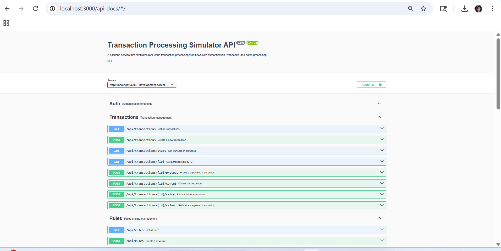

# Transaction Processing Simulator

A backend service that simulates real-world transaction processing workflows with authentication, webhooks, and batch processing.

## Live Demo

**Try it now:** [https://transaction-processing-simulator-production.up.railway.app/api-docs](https://transaction-processing-simulator-production.up.railway.app/api-docs)

---

## Why I Built This

I built this project based on my 7 years of experience in payments operations at Navy Federal Credit Union. I'm transitioning into application engineering, and I wanted to demonstrate that I understand not just the operations side, but the technical systems behind it.

The design decisions — the rules engine, transaction lifecycle, webhook system — are based on patterns I've worked with in production financial systems. This simulator mirrors real-world payment workflows including fraud detection, compliance checks, and batch processing.

**Tech Stack:** TypeScript, Node.js, Express, MongoDB



---

## Features

- **JWT Authentication** - Secure login/register with role-based access control (admin, operator, user)
- **Transaction Management** - Full lifecycle: create, process, cancel, refund, retry
- **Rules Engine** - Define business rules to evaluate and validate transactions
- **Webhooks** - Subscribe to transaction events with automatic retries and HMAC signatures
- **Batch Processing** - Bulk operations for high-volume scenarios
- **Rate Limiting** - API protection against abuse
- **Swagger/OpenAPI** - Interactive API documentation
- **MongoDB Support** - Optional persistence with in-memory fallback
- **Error Logging** - Comprehensive error tracking with Winston

---

## Quick Start

### Prerequisites
- Node.js 18+ 
- npm or yarn
- MongoDB (optional)

### Installation

```bash
# Clone the repository
git clone https://github.com/tbarnett42/transaction-processing-simulator.git
cd transaction-processing-simulator

# Install dependencies
npm install

# Run in development mode (with hot reload)
npm run dev

# Build for production
npm run build

# Run production build
npm start

# Run tests
npm test
```

The server will start at **http://localhost:3000**

### Default Login
```
Email: admin@example.com
Password: admin123
```

---

## API Documentation

Visit **http://localhost:3000/api-docs** for interactive Swagger documentation.

Or try the **[Live Demo](https://transaction-processing-simulator-production.up.railway.app/api-docs)**

---

## API Endpoints

### Authentication

| Method | Endpoint | Description |
|--------|----------|-------------|
| POST | `/api/auth/register` | Register a new user |
| POST | `/api/auth/login` | Login and get JWT token |
| GET | `/api/auth/me` | Get current user profile |

### Transactions

| Method | Endpoint | Description |
|--------|----------|-------------|
| POST | `/api/transactions` | Create a new transaction |
| GET | `/api/transactions` | List all transactions |
| GET | `/api/transactions/:id` | Get a specific transaction |
| POST | `/api/transactions/:id/process` | Process a pending transaction |
| POST | `/api/transactions/:id/retry` | Retry a failed transaction |
| POST | `/api/transactions/:id/cancel` | Cancel a transaction |
| POST | `/api/transactions/:id/refund` | Refund a completed transaction |
| GET | `/api/transactions/stats` | Get transaction statistics |

### Rules

| Method | Endpoint | Description |
|--------|----------|-------------|
| GET | `/api/rules` | List all rules |
| POST | `/api/rules` | Create a new rule |
| GET | `/api/rules/:id` | Get a specific rule |
| PUT | `/api/rules/:id` | Update a rule |
| DELETE | `/api/rules/:id` | Delete a rule |
| POST | `/api/rules/:id/enable` | Enable a rule |
| POST | `/api/rules/:id/disable` | Disable a rule |

### Webhooks

| Method | Endpoint | Description |
|--------|----------|-------------|
| GET | `/api/webhooks` | List all webhooks |
| POST | `/api/webhooks` | Create a new webhook subscription |
| GET | `/api/webhooks/:id` | Get a specific webhook |
| DELETE | `/api/webhooks/:id` | Delete a webhook |

### Batch Operations

| Method | Endpoint | Description |
|--------|----------|-------------|
| POST | `/api/batch/create` | Create multiple transactions |
| POST | `/api/batch/process` | Process multiple transactions |
| POST | `/api/batch/cancel` | Cancel multiple transactions |
| POST | `/api/batch/retry` | Retry multiple failed transactions |

### Errors

| Method | Endpoint | Description |
|--------|----------|-------------|
| GET | `/api/errors` | List all errors |
| GET | `/api/errors/unresolved` | List unresolved errors |
| GET | `/api/errors/stats` | Get error statistics |
| POST | `/api/errors/:id/resolve` | Mark error as resolved |

---

## Transaction Status Lifecycle

```
PENDING --> VALIDATING --> PROCESSING --> COMPLETED
    |           |              |              |
    v           v              v              v
CANCELLED    FAILED         FAILED        REFUNDED
                |
                v
          PENDING (retry)
```

---

## Default Rules

1. **Very High Amount Block** - Blocks transactions over $100,000
2. **High Amount Threshold** - Flags transactions over $10,000
3. **Minimum Amount** - Rejects transactions below $0.01
4. **Supported Currencies** - Only allows USD, EUR, GBP

---

## Configuration

Create a `.env` file in the root directory:

```env
# Server
PORT=3000
NODE_ENV=development

# MongoDB (optional - uses in-memory if not set)
MONGODB_URI=mongodb://localhost:27017/transaction-simulator

# JWT
JWT_SECRET=your-super-secret-key-change-in-production
JWT_EXPIRES_IN=24h
```

---

## Project Structure

```
src/
├── config/              # Configuration
│   ├── index.ts         # Main config
│   ├── database.ts      # MongoDB connection
│   └── swagger.ts       # OpenAPI specification
├── controllers/         # Request handlers
├── middleware/          # Express middleware
│   ├── auth.ts          # JWT authentication
│   ├── rateLimiter.ts   # Rate limiting
│   ├── logging.ts       # Request logging
│   ├── validation.ts    # Input validation
│   └── errorHandler.ts  # Error handling
├── models/              # TypeScript interfaces & types
│   └── schemas/         # Mongoose schemas
├── routes/              # API route definitions
├── services/            # Business logic
│   ├── AuthService.ts   # JWT & user management
│   ├── TransactionService.ts
│   ├── RulesEngine.ts
│   ├── WebhookService.ts
│   ├── BatchService.ts
│   └── ErrorLogger.ts
└── index.ts             # Application entry point
```

---

## Security Features

- **Password Hashing** - bcrypt with configurable salt rounds
- **JWT Tokens** - Secure token-based authentication
- **Role-Based Access** - admin, operator, user roles
- **Rate Limiting** - Configurable per-endpoint limits
- **HMAC Signatures** - Webhook payload verification
- **Input Validation** - Request payload validation

---

## Testing

```bash
# Run all tests
npm test

# Run tests with coverage
npm test -- --coverage
```

---

## License

MIT

---

Made with Node.js, TypeScript, and Express
