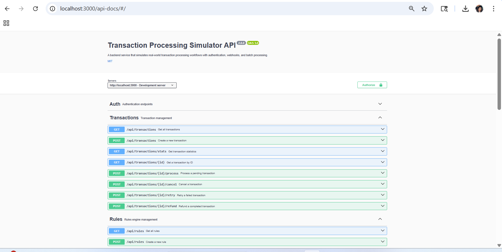

# Transaction Processing Simulator

A backend service that simulates real-world transaction processing workflows with authentication, webhooks, and batch processing.


## Live Demo
- Swagger API Docs: https://transaction-processing-simulator-production.up.railway.app/api-docs

## Why I Built This

I work in payment operations and wanted to demonstrate that I understand the technical systems behind it — not just the business side.

The design decisions (rules engine, transaction lifecycle, webhook system) are based on patterns used in production financial systems. This simulator mirrors real-world payment workflows including fraud detection, compliance checks, and settlement processes.

**Tech Stack:** TypeScript, Node.js, Express, MongoDB, Jest



---

## Features

- **JWT Authentication** - Secure login/register with role-based access control
- **Transaction Management** - Full lifecycle: create, process, cancel, refund, retry
- **Rules Engine** - Configurable business rules for validation and fraud detection
- **Webhooks** - Event subscriptions with automatic retries and HMAC signatures
- **Batch Processing** - Bulk operations for high-volume scenarios
- **CI/CD** - GitHub Actions runs 41 automated tests on every push
- **Rate Limiting** - API protection against abuse
- **Swagger/OpenAPI** - Interactive API documentation

---

## Quick Start

### Prerequisites
- Node.js 18+ 
- npm or yarn
- MongoDB (optional)

### Installation
```bash
git clone https://github.com/tbarnett42/transaction-processing-simulator.git
cd transaction-processing-simulator
npm install
npm run dev
```

The server starts at **http://localhost:3000**

### Other Commands
```bash
npm run build    # Build for production
npm start        # Run production build
npm test         # Run tests
```

---

## API Documentation
- Local: http://localhost:3000/api-docs
- Production: https://transaction-processing-simulator-production.up.railway.app/api-docs

---

## Architecture
```
src/
├── config/          # Configuration (database, JWT, Swagger)
├── middleware/      # Auth, rate limiting, validation, error handling
├── routes/          # API route definitions
├── controllers/     # Request handlers
├── services/        # Business logic
│   ├── AuthService.ts
│   ├── TransactionService.ts
│   ├── RulesEngine.ts
│   ├── WebhookService.ts
│   └── BatchService.ts
├── models/          # TypeScript interfaces & Mongoose schemas
└── index.ts         # Entry point
```

### Request Flow
```
Request → Middleware (auth, rate limit) → Route → Controller → Service → Response
                                                       ↓
                                              WebhookService (async)
```

---

## Transaction Lifecycle
```
PENDING → VALIDATING → PROCESSING → COMPLETED
   ↓          ↓            ↓            ↓
CANCELLED   FAILED      FAILED      REFUNDED
              ↓
         PENDING (retry)
```

---

## Rules Engine

Every transaction is evaluated against configurable business rules.

| Action | Behavior |
|--------|----------|
| ALLOW | Transaction proceeds |
| DENY | Transaction blocked |
| FLAG | Proceeds but marked for review |
| REQUIRE_APPROVAL | Needs supervisor approval |

### Default Rules
- Block transactions over $100,000
- Flag transactions over $10,000
- Reject transactions below $0.01
- Only allow USD, EUR, GBP

---

## API Endpoints

### Authentication
| Method | Endpoint | Description |
|--------|----------|-------------|
| POST | `/api/auth/register` | Register new user |
| POST | `/api/auth/login` | Login and get JWT |
| GET | `/api/auth/me` | Get current user |

### Transactions
| Method | Endpoint | Description |
|--------|----------|-------------|
| POST | `/api/transactions` | Create transaction |
| GET | `/api/transactions` | List all |
| GET | `/api/transactions/:id` | Get one |
| POST | `/api/transactions/:id/process` | Process |
| POST | `/api/transactions/:id/retry` | Retry failed |
| POST | `/api/transactions/:id/cancel` | Cancel |
| POST | `/api/transactions/:id/refund` | Refund |

### Rules
| Method | Endpoint | Description |
|--------|----------|-------------|
| GET | `/api/rules` | List rules |
| POST | `/api/rules` | Create rule |
| PUT | `/api/rules/:id` | Update rule |
| DELETE | `/api/rules/:id` | Delete rule |

### Webhooks
| Method | Endpoint | Description |
|--------|----------|-------------|
| GET | `/api/webhooks` | List webhooks |
| POST | `/api/webhooks` | Subscribe |
| DELETE | `/api/webhooks/:id` | Unsubscribe |

### Batch
| Method | Endpoint | Description |
|--------|----------|-------------|
| POST | `/api/batch/create` | Create multiple |
| POST | `/api/batch/process` | Process multiple |

---

## Configuration
```env
PORT=3000
NODE_ENV=development
MONGODB_URI=mongodb://localhost:27017/transaction-simulator
JWT_SECRET=your-secret-key
JWT_EXPIRES_IN=24h
```

---

## Security

- Password hashing (bcrypt)
- JWT authentication
- Role-based access control
- Rate limiting
- HMAC webhook signatures
- Input validation

---

## License

MIT
